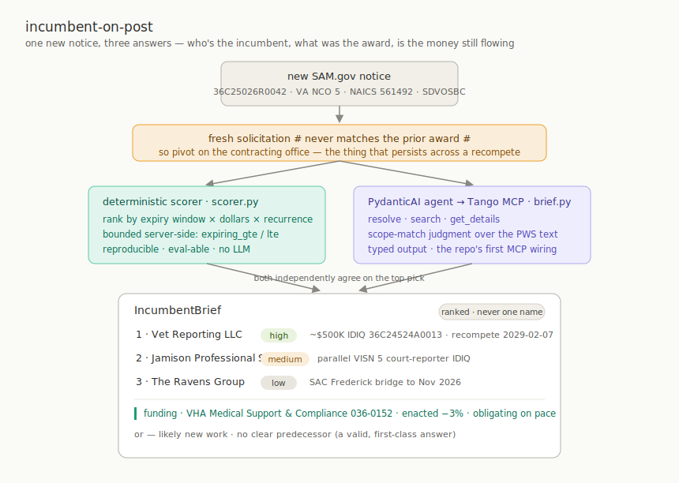

# Incumbent-on-post

A new opportunity hits SAM.gov. Before you've finished reading the title, you want three things: **who's the incumbent, what was the prior award worth, and is the money still flowing?** This example answers all three from one notice — and is honest about the one question that has no clean answer.

It's also the cookbook's **first MCP integration**. Every other example hand-wires the `tango-python` SDK; here the tool catalog comes from the hosted [Tango MCP server](https://govcon.dev/mcp), and a [PydanticAI](https://ai.pydantic.dev) agent drives it.



## The join you can't make

The obvious idea — match the new opportunity to the prior contract on the solicitation number — **does not work**. A fresh recompete gets a brand-new solicitation number; the predecessor award carries the old one. They never match. There is no clean key from notice → incumbent.

So you pivot on the thing that *persists* across a recompete: the **contracting office**. The incumbent is whoever holds an award out of that office, in that NAICS/PSC, **whose clock is running out** — ranked by period-of-performance / IDV `last_date_to_order` landing near the notice, not by who won most recently (recency surfaces brand-new awards, the opposite of a recompete). And because that's an inference, the honest output is a **ranked shortlist with confidence and evidence**, never a single asserted name — plus a first-class *"likely new work / no clear predecessor"* answer for first-time buys and in-house work.

## The arc: plausible → shippable

The example is two files on purpose.

**1. `brief.py` — the agent (the easy version).** A PydanticAI agent pointed at the Tango MCP. It resolves the office, searches contracts and IDVs, and returns a typed `IncumbentBrief`. The MCP wiring is the whole point — it's about ten lines:

```python
tango_mcp = MCPServerStreamableHTTP("https://govcon.dev/mcp", headers={"X-Tango-API-Key": api_key})
agent = Agent("anthropic:claude-sonnet-4-6", toolsets=[tango_mcp], output_type=IncumbentBrief, instructions=DOCTRINE)
async with agent:
    result = await agent.run(notice_prompt)
```

It gets a *plausible* answer. Plausible isn't shippable: the ranking is improvised fresh each run, so you can't tell when it regresses.

**2. `scorer.py` — the deterministic scorer (the honest version).** The same office-pivot, but the ranking is a plain scored function — recompete-window proximity, dollar magnitude, vendor recurrence — bounded server-side with the SDK's `expiring_gte/lte` and `last_date_to_order_gte/lte` filters. No model in the ranking, so it's reproducible and **eval-able** (`evals.py` pins it to invariants). Run this first; fall through to the agent's scope-match judgment only when it comes back thin.

That's the lesson the recipe is really teaching: **let the model do the fuzzy language step (does this award's scope match the notice?), and keep the ranking deterministic.**

## Run it

From the repo root:

```bash
just incumbent                 # runs the agent on examples/incumbent-on-post/sample_notice.json
just incumbent path/to/notice.json
just incumbent-evals           # deterministic scorer invariants — no LLM key needed
```

`just incumbent` needs `TANGO_API_KEY` (for the MCP server) **and** `ANTHROPIC_API_KEY` (for the model). `just incumbent-evals` needs only `TANGO_API_KEY`.

### The notice shape

The agent and scorer take an enriched notice — what a Tango opportunities webhook gives you, plus a `get_opportunity` lookup to fill in office/NAICS/PSC. See [`sample_notice.json`](./sample_notice.json). The field that matters most is `office_code`: pass the **most specific** awarding office, not the parent department. Department-level filtering (`VA`, `DHS`) returns noise — DHS alone has 22 components.

## Hosted vs. local MCP

By default `brief.py` talks to the hosted server at `https://govcon.dev/mcp` with your key in the `X-Tango-API-Key` header. To run the [Tango MCP server](https://tango.makegov.com) locally over stdio instead, swap `MCPServerStreamableHTTP` for `MCPServerStdio`, or point `TANGO_MCP_URL` at your own deployment.

## Wiring it to a real trigger

This example takes a notice on the command line. To make it a pipeline, feed it from the [`webhook-receiver`](../webhook-receiver/) (low-latency, server-side) or the [`saved-search-watcher`](../saved-search-watcher/) (you own the cadence): on each *new* opportunity, run the scorer, fall through to the agent when thin, and push the brief. Cap the fan-out — a big webhook batch shouldn't trigger dozens of entity/budget lookups.

## Where to take it next

- **Funding signal.** The `IncumbentBrief.funding` field is wired through the schema and prompt but is the lightest part of the agent's job. Deepen it: pull `get_budget_account` + quarterly cash flow for the office's account and report the enacted→obligated YoY delta as a real "is the money there" read. Gate it to high-value opportunities so you stay under your lookup budget.
- **Scope match as a model step.** The scorer ranks on expiry + magnitude + recurrence; it does *not* read the PWS. Add an opt-in step where the model scores scope similarity between the notice description and each candidate's award description — that's the one judgment code can't make.
- **Grow the eval set.** `evals.py` ships three structural cases. Every time the scorer surprises you, add the case. That's how you learn whether the office→category join is good enough before you trust it.

## Caveats

- **Not run in CI.** `brief.py` calls a paid LLM and a live API and is non-deterministic. `evals.py` is deterministic but still hits the live API, so it isn't part of the notebook CI either. Treat both as starting points.
- **The incumbent is always an inference.** Office realignments, bridge/sole-source extensions, work moving between vehicles, and genuinely new buys all break the office pivot. The shortlist is a lead, not a finding — which is exactly why the schema won't let it assert a single name.
