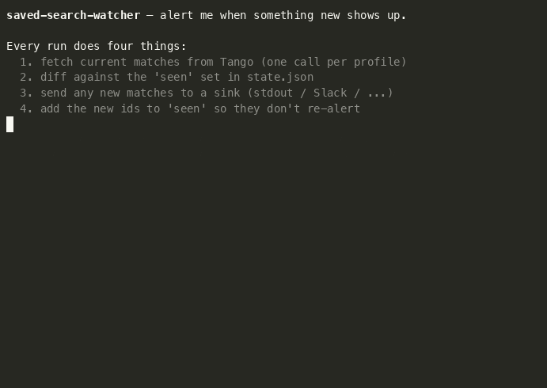

# Saved-search watcher



A YAML-driven watcher that runs a list of saved Tango searches on every invocation, diffs the results against a small JSON state file, and alerts on new matches. ~180 lines.

> Step 3 of the demo ("simulate a new match") forgets one id per profile from `state.json` so step 4 has something to alert on. In production, that forgetting happens for free when Tango ingests a record matching your filter — same code path, different trigger.

It's the simplest honest version of the "tell me when something new shows up" pattern. Most teams hand-roll this with a cron job and a `seen.txt`; this just packages the shape so you can fork it and ship something useful by lunch.

> **Already have webhook alerts?** Tango also pushes alerts to a URL of your choice — see [`../webhook-receiver/`](../webhook-receiver/). Use webhooks when you want low-latency, server-side filtering; use this watcher when you want to own the polling cadence, run on a host you already have, or batch alerts your own way.

## Run it

From the repo root:

```bash
cp examples/saved-search-watcher/profiles.example.yaml \
   examples/saved-search-watcher/profiles.yaml

just watch --seed     # first run: record everything as "seen" so you don't get spammed
just watch            # every subsequent run: alert on what's new
```

Or directly:

```bash
uv run python examples/saved-search-watcher/watcher.py [--profiles ...] [--state ...] [--seed] [--dry-run]
```

Needs `TANGO_API_KEY` in `.env`. `SLACK_WEBHOOK_URL` is only needed if a profile uses `sink: slack`.

## What a profile looks like

```yaml
- name: small-IT-recompetes
  endpoint: opportunities          # opportunities | contracts | notices | forecasts | protests
  key: opportunity_id              # field on each result used to dedupe
  fields: [title, agency, response_deadline]   # shown in the alert line
  filters:                         # passed as kwargs to the SDK's list_*
    naics: "541512"
    set_aside: SBA
    notice_type: o
    active: true
    response_deadline_after: "{today}"   # {today} -> current ISO date
  sink: stdout                     # stdout | slack
  limit: 25
```

Filter keys are exactly the SDK's `list_<endpoint>` kwargs — anything `list_opportunities` accepts works under `opportunities`, and so on. See [`profiles.example.yaml`](./profiles.example.yaml) for three runnable examples.

## How the diff works

State lives in `state.json` next to `profiles.yaml`:

```json
{
  "version": 1,
  "profiles": {
    "small-IT-recompetes": {
      "last_run": "2026-06-05T18:00:00+00:00",
      "seen": ["abc123", "def456", "..."]
    }
  }
}
```

On each run, the watcher:

1. Calls the SDK with the profile's filters.
2. Pulls each result's `key` field — e.g. `opportunity_id`.
3. Compares against `seen` for that profile.
4. Sends new ones to the sink.
5. Adds the new IDs to `seen` (capped at 5000 per profile, most-recent-first).

`--seed` skips step 4 — useful on first run so you don't get blasted with whatever the current top-25 results happen to be.

## Making it recurring

The script is single-shot on purpose. Drop it behind whatever scheduler you already trust:

- **cron** (every 10 min):
  ```cron
  */10 * * * * cd /path/to/tango-cookbook && /usr/bin/env -i PATH=$PATH uv run python examples/saved-search-watcher/watcher.py >> /tmp/watcher.log 2>&1
  ```
- **launchd** on macOS — `StartInterval` or a `StartCalendarInterval` plist.
- **systemd timer** on Linux — pair a `.service` with a `.timer` unit.
- **GitHub Actions** — `schedule: cron:` workflow, commit `state.json` back to the repo (or stash it in an artifact / S3).

## Where to take it next

- **More sinks.** `emit_stdout` and `emit_slack` are the two functions you'll touch — copy one to add email (SES, SendGrid), Discord, PagerDuty, a Notion page, a database row, whatever.
- **Richer alerts.** The default alert line is `field=value` pairs. Pass the whole record to your sink and format it however you want — Slack blocks, an email template, a Markdown digest.
- **Per-profile schedules.** Today every profile runs every invocation. If you want a fast-moving profile to poll every 5 min and a slow one every day, run the watcher with different `--profiles` files on different cron cadences. Or add a `cooldown` field and check `last_run` before re-querying.
- **Persisted matches.** Currently we remember IDs, not records. If you want to look up "what was the title of `abc123` when I first saw it," widen the state file to keep the matched record (or just store it in a DB on alert).
- **Webhook receiver.** When you outgrow polling — too many profiles, too slow a cadence, or you want server-side filtering — switch to [`../webhook-receiver/`](../webhook-receiver/). Tango will push to you instead.

## Caveats

- **Not run in CI.** Hits a live API; results are non-deterministic.
- **Single-shot, single-process.** No locking. If you schedule it more frequently than it can complete, runs will overlap and double-alert. The fix is usually "lengthen the interval"; for serious deployments, wrap with `flock` or move to webhooks.
- **The `{today}` placeholder is plain string substitution.** Good enough for date filters; if you need anything richer, expand `_render_filters` in `watcher.py`.
