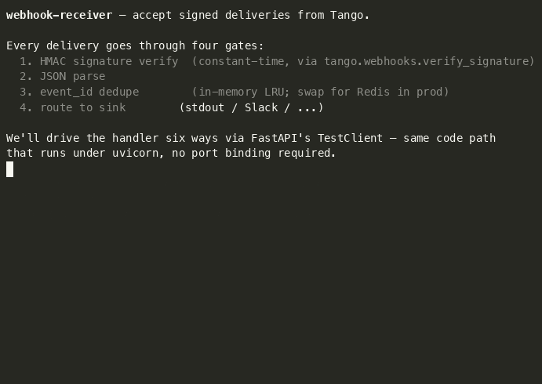

# Webhook receiver



A ~80-line FastAPI app that accepts Tango webhook deliveries, verifies the HMAC signature, dedupes redelivered events, and routes each one to a sink (stdout or Slack).

> The GIF drives the receiver via FastAPI's `TestClient` — same handler code that runs under uvicorn, no port binding required. The six cases shown (healthz, valid POST, duplicate, bad sig, missing sig, tampered body, malformed JSON) exercise every gate the receiver enforces.

This is the right shape for "tell me when something new happens" once you've outgrown polling — server-side filtering, push delivery, no cron drift.

> **Picking between this and the watcher.** [`../saved-search-watcher/`](../saved-search-watcher/) pulls; this one is pushed-to. Use the watcher when you want to own the schedule, run on a host you already have, or are happy with minute-scale latency. Use this when you want low-latency delivery, server-side filtering, and a real subscription model.

## Run it

From the repo root:

```bash
# 1. Start the receiver (defaults to :8000).
just webhook-serve

# 2. In another terminal, expose it with a tunnel of your choice.
#    Tango can't deliver to localhost.
ngrok http 8000
# or: cloudflared tunnel --url http://localhost:8000
# or: tailscale funnel 8000

# 3. Register a webhook endpoint + an example alert against that public URL.
just webhook-register https://<your-tunnel>.ngrok.app/webhooks/tango
```

`webhook-register` writes the new `TANGO_WEBHOOK_SECRET` to `examples/webhook-receiver/webhook.secret` (mode `0600`, gitignored) — it is **not** printed to stdout, because stdout ends up in shell history, terminal recorders, and CI logs. Load it before restarting the receiver:

```bash
set -a && source examples/webhook-receiver/webhook.secret && set +a
just webhook-serve
```

`register.py` also fires a test delivery, so you should see one event in the server logs almost immediately. After that, real matches against the alert's filters will stream in.

## Environment

| Variable | Required | Purpose |
| --- | --- | --- |
| `TANGO_API_KEY` | yes (for `register.py`) | Used to create the endpoint + alert. |
| `TANGO_WEBHOOK_SECRET` | yes (for `server.py`) | Shared secret from `create_webhook_endpoint`. Verifies every delivery. |
| `WEBHOOK_SINK` | no | `stdout` (default) or `slack`. |
| `SLACK_WEBHOOK_URL` | only if `WEBHOOK_SINK=slack` | Incoming-webhook URL. |

## What's actually happening

```
┌──────────┐   POST /webhooks/tango   ┌──────────────┐   ┌────────┐
│  Tango   │ ───────────────────────▶ │  receiver    │ ─▶│  sink  │
│ alerts   │  X-Tango-Signature: ...  │ (FastAPI)    │   └────────┘
└──────────┘                          └──────────────┘
                                            │
                                            ▼
                                      verify sig
                                      dedupe by event_id
                                      route by event_type
```

Each delivery:

1. The receiver reads the raw body and the `X-Tango-Signature` header.
2. [`tango.webhooks.verify_signature`](https://pypi.org/project/tango-python/) does a constant-time HMAC-SHA256 compare against `TANGO_WEBHOOK_SECRET`. Mismatch → `401`.
3. The event's `event_id` is checked against an in-memory LRU. Dupes return `200` with `status: "duplicate"` so Tango stops retrying.
4. The configured sink emits the event. Sink failure → `500` so Tango will retry.

That's it. The whole receiver is in [`server.py`](./server.py) — `emit_stdout` and `emit_slack` are the only functions you'll usually edit.

## Where to take it next

- **More sinks.** Copy `emit_stdout` to add email, PagerDuty, Discord, a database row, a queue, etc. Sinks are dict-in, side-effect-out — no framework.
- **Persistent dedupe.** The in-memory LRU is fine for one process. Move to Redis or a SQL row when you run more than one replica or you care about deduping across restarts.
- **Per-event-type routing.** Right now every event goes to the same sink. Branch on `event_type` to send opportunity matches to one Slack channel and protest matches to another.
- **Backpressure.** If your sink is slow (e.g. an LLM summarization step), `await` is fine for a while, but at some point you want to ack fast and enqueue. Push events onto a queue (SQS, Redis Streams, Postgres `LISTEN/NOTIFY`) and process out of band.
- **Multiple alerts.** [`register.py`](./register.py) sets up one example alert. Add more by calling `tango.create_webhook_alert(...)` repeatedly — different `name`, `query_type`, `filters`. One endpoint can fan in many alerts.
- **Deploy.** This runs anywhere Uvicorn does — Fly.io, Render, Railway, Cloud Run, an EC2 instance, a Pi. For something this small, a single-instance ASGI deploy with a managed TLS cert is plenty.

## Caveats

- **Not run in CI.** Hits the live Tango API; requires inbound HTTPS.
- **In-memory dedupe is per-process.** Restart loses state; multi-replica double-fires. Real deployments want Redis or equivalent.
- **The example alert uses opportunities + SBA + NAICS 541512 + Solicitation.** Edit [`register.py`](./register.py) before running it if those aren't useful filters for you.
- **One endpoint, many alerts.** Don't create a fresh endpoint per alert — you'll have N secrets to manage. One endpoint, many alerts against it, is the supported model.
