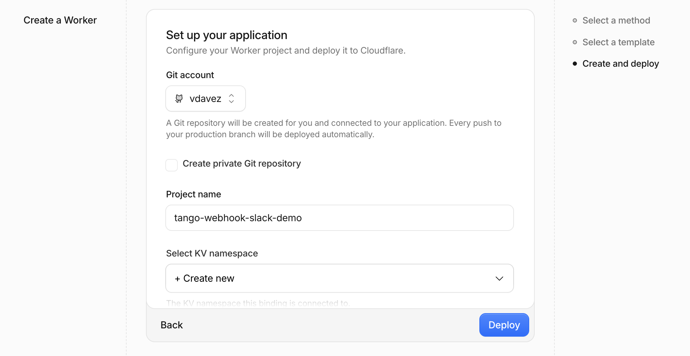
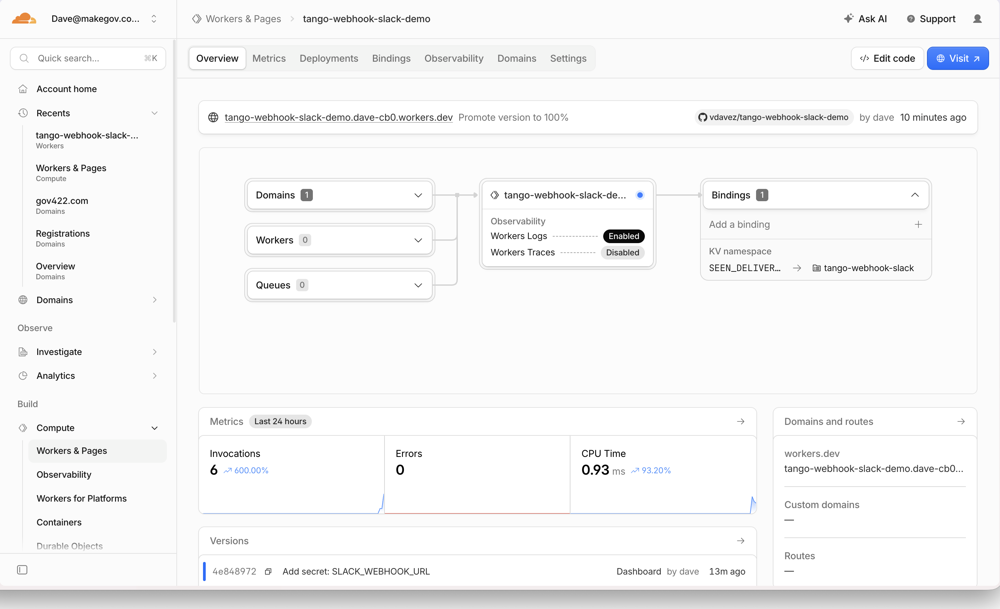
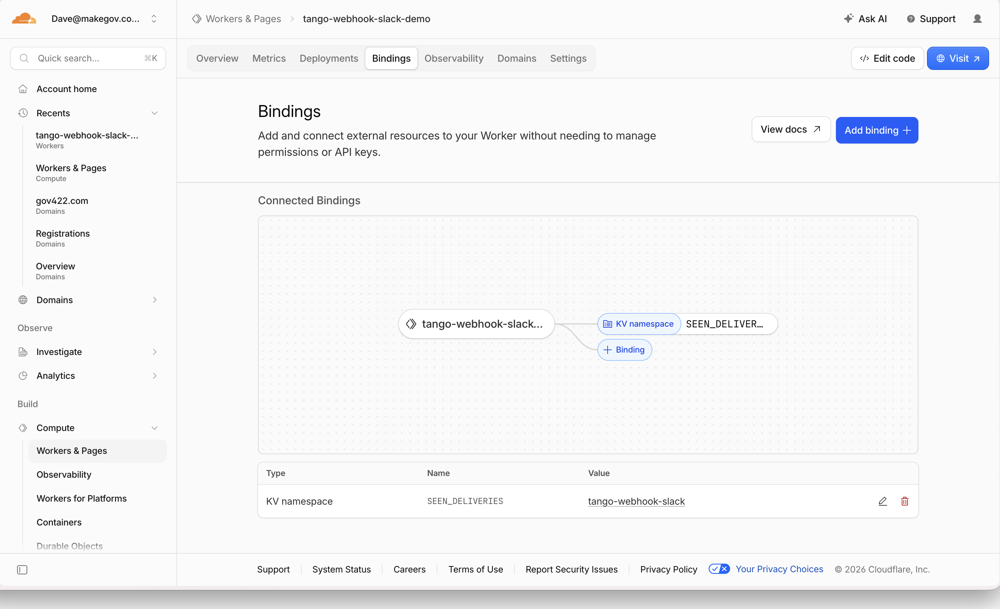
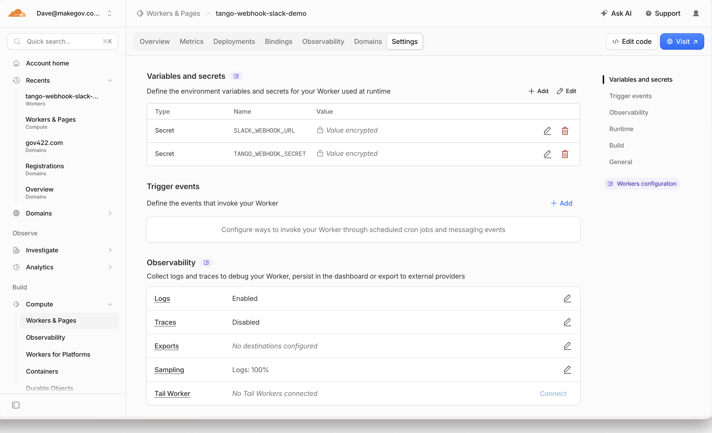
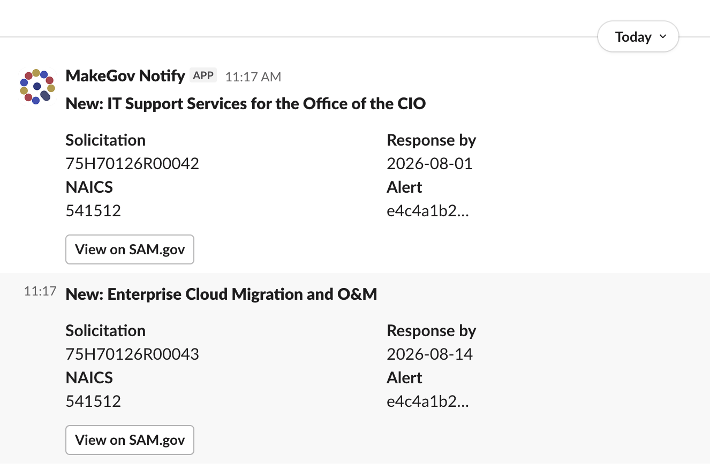

# Webhook worker: the easy button

Tango webhooks, minus the yak-shaving. One click deploys a Cloudflare Worker that takes matches from a saved Tango alert and drops them into a Slack channel. No server to run, no tunnel, no signature code to write.

[](https://deploy.workers.cloudflare.com/?url=https://github.com/makegov/tango-cookbook/tree/main/examples/webhook-worker)

> **This vs. [`../webhook-receiver/`](../webhook-receiver/).** Same job, different host. The receiver is a FastAPI app you run somewhere and expose, which is the better fit when you want the code in your own stack or a sink richer than Slack. This is the zero-infrastructure path: a single dependency-free Worker on Cloudflare's edge, provisioned by a button. Reach for it when the ask is "just tell me in Slack when something matches."

## What it looks like

The button reads [`wrangler.jsonc`](./wrangler.jsonc) and provisions everything. The project name and the KV namespace binding come pre-filled, so you never hand-configure the Worker or the KV store:



Then the deployed Worker: its binding, its secrets, and the result in Slack.

| | |
| --- | --- |
|  |  |
| **Overview:** deployed, one binding, public URL. | **Bindings:** the `SEEN_DELIVERIES` KV namespace, auto-provisioned. |
|  |  |
| **Variables & secrets:** the two secrets, encrypted. | **The payoff:** matches land in Slack. |

## Deploy it

**1. Click the button.** Cloudflare connects your GitHub, creates a new repository on your account wired to the Worker (every push redeploys), provisions the `SEEN_DELIVERIES` KV namespace for idempotency, and deploys. The project name and KV binding come from [`wrangler.jsonc`](./wrangler.jsonc), so there's nothing to fill in.

**1a. Enable the public URL.** A freshly deployed Worker has no public URL: the `workers.dev` route is off by default. Open the Worker → **Settings → Domains & Routes** (or the Overview) and enable it. That's the URL you register with Tango: `https://tango-webhook-slack.<your-subdomain>.workers.dev/webhooks/tango`.

**2. Set the two secrets.** From the deployed Worker (Cloudflare dashboard → the Worker → Settings → Variables), or from a local clone:

```bash
npx wrangler secret put SLACK_WEBHOOK_URL     # your Slack Incoming Webhook
npx wrangler secret put TANGO_WEBHOOK_SECRET  # from the endpoint you register in step 3
```

`SLACK_WEBHOOK_URL` comes from [Slack's Incoming Webhooks](https://api.slack.com/messaging/webhooks) (three clicks: create app, enable Incoming Webhooks, add to a channel). `TANGO_WEBHOOK_SECRET` gets written to a file when you register the endpoint next.

**3. Register the endpoint + an alert.** Point Tango at your Worker's `/webhooks/tango` path. [`register.mjs`](./register.mjs) uses the Node SDK ([`@makegov/tango-node`](https://www.npmjs.com/package/@makegov/tango-node)), so registration stays in the Worker's language with no Python toolchain. It creates the endpoint, writes the secret to a `0600` file beside it (`webhook.secret`, gitignored, never printed so it can't leak into shell history or CI logs), attaches one opportunities alert, and fires a test delivery:

```bash
just webhook-worker-register https://tango-webhook-slack.<your-subdomain>.workers.dev/webhooks/tango
```

Then set the secret it wrote. Registration is a one-time admin step; the SDK is a dev dependency and never runs inside the Worker.

```bash
npx wrangler secret put TANGO_WEBHOOK_SECRET   # paste the value from webhook.secret
```

Once `TANGO_WEBHOOK_SECRET` and `SLACK_WEBHOOK_URL` are both set on the Worker, re-fire a test (`npm run register` again, or from the Tango dashboard) and the match lands in your Slack channel within a few seconds.

## Run it locally

```bash
cd examples/webhook-worker
npm install
just webhook-worker-smoke   # offline: sign the sample delivery, assert parsing + Slack blocks
just webhook-worker-dev     # wrangler dev (local server with simulated KV)
```

For `wrangler dev`, put the secrets in a gitignored `.dev.vars` file (`TANGO_WEBHOOK_SECRET=…` / `SLACK_WEBHOOK_URL=…`) instead of `wrangler secret put`.

## Environment

Secrets and bindings, all set on the deployed Worker. Nothing lives in this repo's `.env`.

| Name | Kind | Required | Purpose |
| --- | --- | --- | --- |
| `TANGO_WEBHOOK_SECRET` | secret | yes | Shared HMAC secret from `createWebhookEndpoint` (written to `webhook.secret` by [`register.mjs`](./register.mjs)). Verifies every delivery. |
| `SLACK_WEBHOOK_URL` | secret | no | Slack Incoming Webhook URL. Omit and matches are logged (`wrangler tail`) instead of posted. |
| `SEEN_DELIVERIES` | KV namespace | no | Idempotency store keyed by `delivery_id`. Provisioned by the Deploy button. Without it, dedupe is skipped and a retried delivery may post twice. |

## What's actually happening

```
┌──────────┐  POST /webhooks/tango   ┌───────────────────┐   ┌─────────┐
│  Tango   │ ──────────────────────▶ │  Worker (edge)    │ ─▶│  Slack  │
│ alerts   │  X-Tango-Signature: …   │                   │   └─────────┘
└──────────┘                         │  verify signature │
                                     │  dedupe delivery_id (KV)
                                     │  events[].matches.new[] → blocks
                                     └───────────────────┘
```

Per delivery, the Worker:

1. Reads the raw body and recomputes the `X-Tango-Signature` HMAC-SHA256 with `TANGO_WEBHOOK_SECRET`, comparing in constant time. Mismatch returns `401`.
2. Checks the top-level `delivery_id` against KV. Tango retries on non-2xx and a retried dispatch reuses its `delivery_id`, so a duplicate returns `200` (`status: duplicate`) and does nothing.
3. Walks `events[].matches.new[]`. Each entry is a summary object (`opportunity_id`, `title`, `solicitation_number`, `naics_code`, `response_deadline`), so no follow-up fetch is needed, then POSTs one Slack message per match.
4. Records the `delivery_id` in KV **only after** Slack succeeded. A Slack hiccup returns `500` so Tango retries the whole delivery (up to 5 attempts) rather than dropping matches.

The whole thing is [`src/worker.js`](./src/worker.js). The formatting helpers (`opportunityToBlocks`, `buildMessages`) are the only functions you'll usually edit.

## Where to take it next

- **Other query types.** `buildMessages` renders opportunity matches richly and everything else (contracts, entities, grants, forecasts) as a compact summary. Add a branch per `event_type` to make contract or grant matches just as rich, then swap the alert's `query_type` and `filters` in [`register.mjs`](./register.mjs) to match.
- **Route by alert.** One endpoint can fan in many alerts. Branch on `event.alert_id` (or the echoed `filters`) to send different alerts to different Slack channels, one `SLACK_WEBHOOK_URL` per channel.
- **A richer sink.** Slack is one `fetch`. The same shape posts to Discord, a database (Cloudflare D1), a queue (Cloudflare Queues), or your own API. If the work is slow, ack fast and enqueue rather than blocking the delivery.
- **Own the payload contract.** The batch envelope this parses is documented as the Webhooks payload format §6 (`delivery_id` + `events[]` + `matches.new[]`). Build against that, not the simplified `/sample-payload/` preview.

## Caveats

- **Not run in CI.** The Deploy button and live registration need a Cloudflare account and the live Tango API. The offline `smoke.mjs` (which *is* runnable anywhere Node is) covers the signature, parsing, and formatting logic.
- **Dedupe needs the KV binding.** The button provisions it. Without `SEEN_DELIVERIES`, the Worker still runs but can't dedupe across invocations, so a retried delivery may post the same match twice. Slack duplicates are annoying, not dangerous, which is why it degrades gracefully instead of failing.
- **The example alert watches opportunities in NAICS 541512.** That lives in [`register.mjs`](./register.mjs); edit it before running if that filter isn't useful to you.
- **One endpoint, many alerts.** Don't register a fresh endpoint per alert; you'll juggle N secrets. Register once, attach many alerts.
